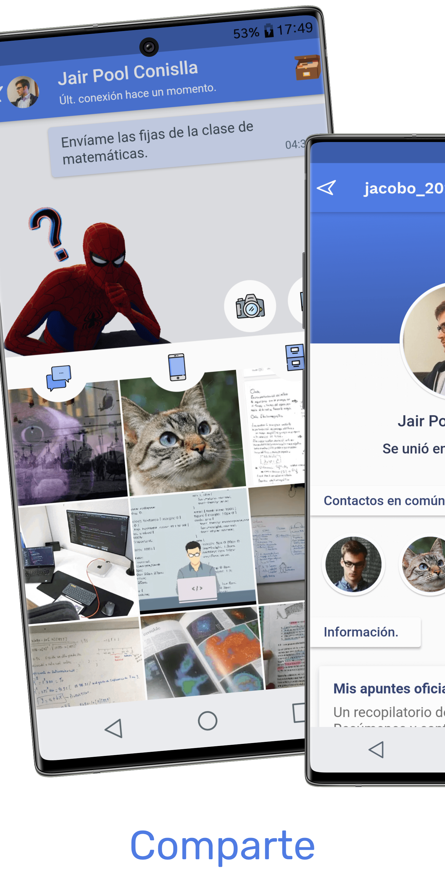
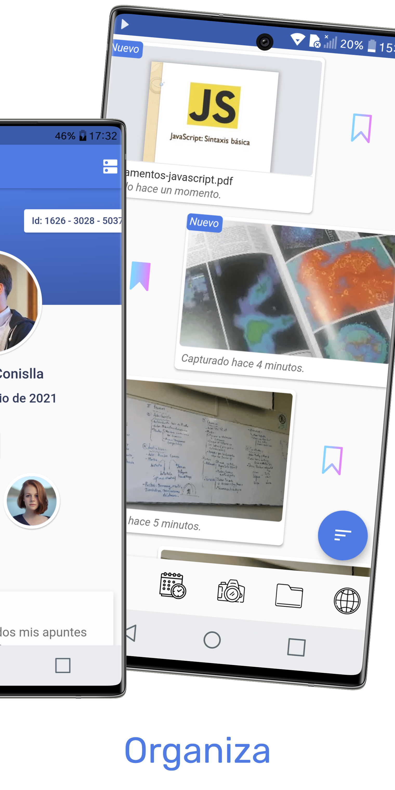
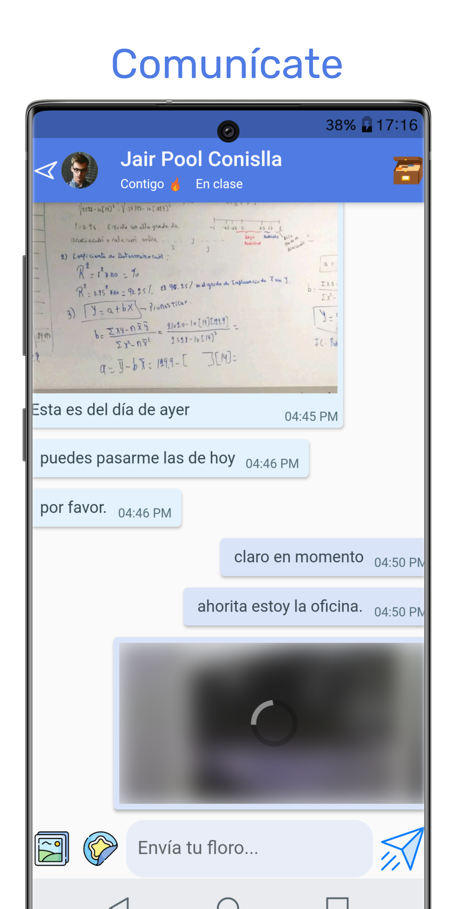
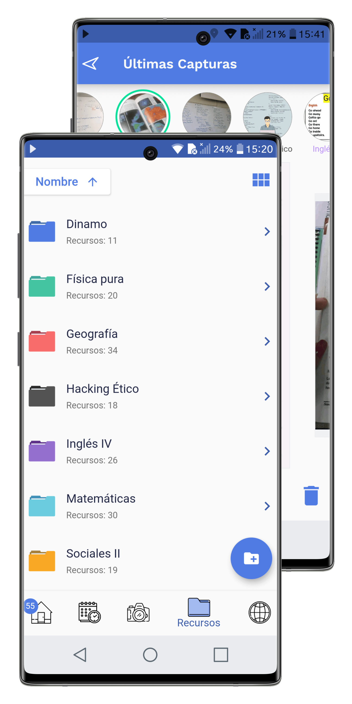
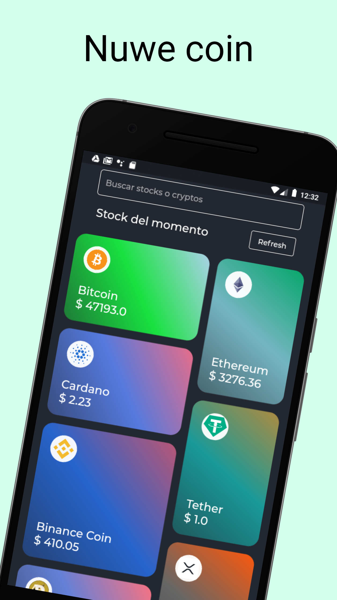
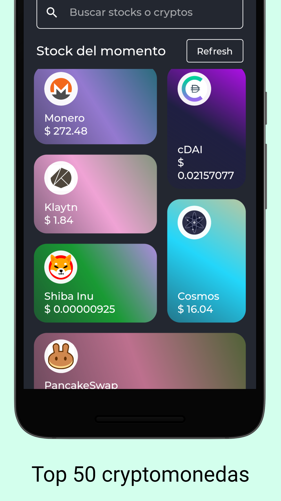
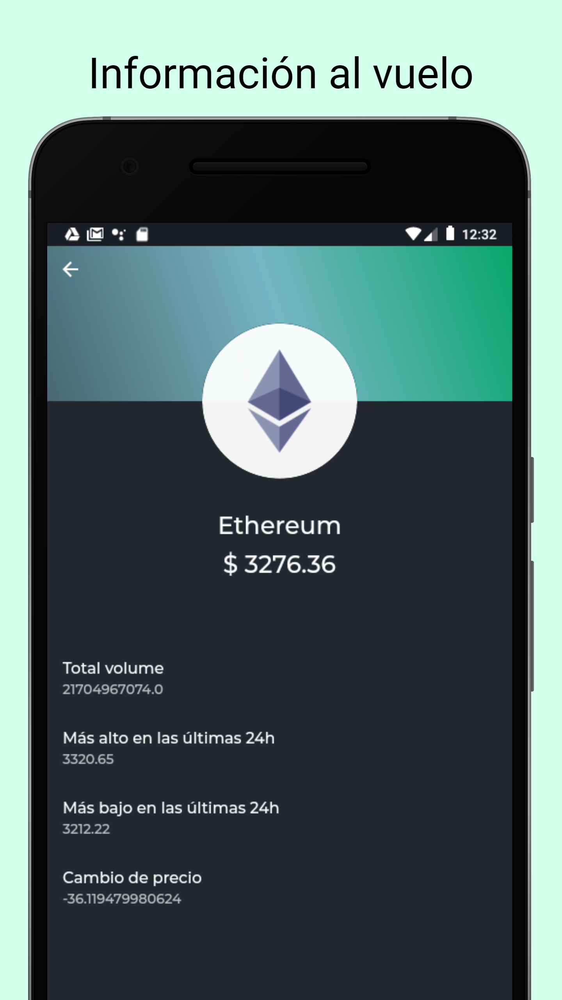
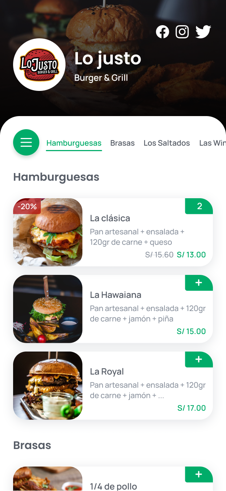
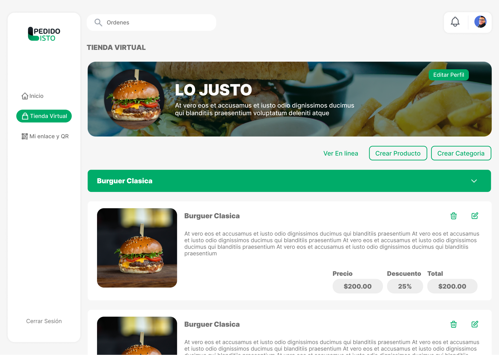
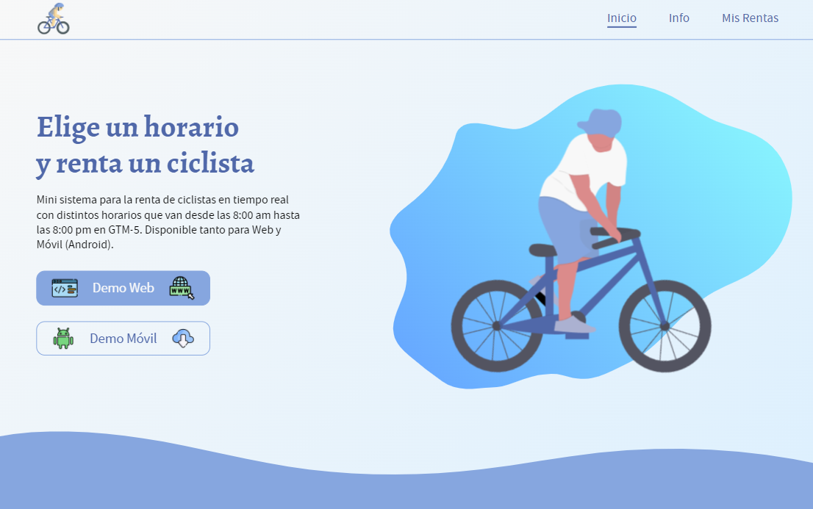

<h1 align="center">Hi 👋, I'm Jair Pool Conislla Bocangel</h1>
<h3 align="center">A passionate multiplatform developer from Perú +3 years</h3>

  

  

- 🔭 I’m currently working on my project [Dinamo](https://dinamo.dre.agchosting.link/#/)

- 🌱 I’m currently learning **web 3.0**

- 👯 I’m looking to collaborate on **Flutter projects** or **Blockchain**

<h3 align="left">Connect with me:</h3>

<a href="https://github.com/fardcrex/fardcrex/blob/main/CV_Jair_Conislla_2022_flutter.pdf" target="_blank">Curriculum Vitae </a>
  

<h3 align="left">Languages and Tools:</h3>

            

<h2>My Projects</h2>

<h4> - Development of Dinamo app as Startup </h4>
<h4>Landing del proyecto <a href="https://dinamo.dra.agchosting.link/"> Dinamo.app </a> </h4>
<h4>Video de presentación <a href="https://firebasestorage.googleapis.com/v0/b/dinamo-landing.appspot.com/o/dinamo_presentacion.MP4?alt=media"> visualizar </a> </h4>

  

<h4> - Development of a simple crypto app <a href="https://github.com/fardcrex/nuwecoin" target="_blank">Nuwe Coin</a> on</h4>
<h5><a href="https://nuwe-coin.netlify.app/#/" target="_blank">Versión Web</a></h5>

 

<h4> - Development of an ordering system for restaurants with Flutter Web</h4>
<h5><a href="" target="_blank">Pedido Listo (muy pronto)</a></h5>

 
 

<h4> - Finalist with the <a href="https://github.com/Keelhaul-Labs-Team/light-curve-app" target="_blank">Light Curve Predictor project</a> on</h4>

  

 

<h4> - Development of a simple frontend-movil system with firebase <a href="https://rent-bike-system.web.app/" target="_blank"> renta de bicicletas</a> </h4>
   

&nbsp;

